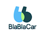

 

    <h1> Universidad Peruana de Ciencias Aplicadas </h1>

  

  

    Ingeniería de Software - 202401
     
    SW58 - Desarollo de Apliaciones Open Source
     
    Docente: Efraín Ricardo Bautista Ubilús
     
    Informe de Trabajo Final
     
    Startup: 
     
    Proyecto: UniRider
  

   <table border="1">
        <tr> 
            <th>Alumno</th>
            <th>Codigo</th>
        </tr>
        <tr> 
            <td>Cervantes Erequita, Valentino Sebastian</td>
            <td>U202110140</td>
        </tr>
        <tr> 
            <td>Chamorro Acero, Salvador Edward</td>
            <td>U201914367</td>
        </tr>
        <tr> 
            <td>Huincho Lapa, Diego Arturo</td>
            <td>U201923466</td>
        </tr>
        <tr> 
            <td>Mayta Lopez, Harold Jaime</td>
            <td>U202114851</td>
        </tr>
        <tr> 
            <td>Vera Nuñez, GNicolas Alejandro</td>
            <td>U202214869</td>
        </tr>
    </table>

  

    Abril-2024
  

<!--
# Registro de Versiones del Informe
|Versión|Fecha|Autor|Descripción de modificación|
|---|---|---|---|
|||||
|||||
|||||

# Project Report Collaboration Insights
URL del repositorio para el reporte del proyecto:

### TB1
Para elaborar el informe correspondiente a la entrega TB1, se distribuyó la responsabilidad de redactar las distintas secciones de la siguiente manera entre cada miembro del equipo:

|Integrante|Tareas Asignadas|
|---|---|
|Valentino Cervantes||
|Salvador Chamorro||
|Diego Huincho||
|Harold Mayta||
|Nicolas Vera||

La colaboración en la creación del informe se llevó a cabo a través de una serie de contribuciones constantes al repositorio de la organización UniRider.

## GitHub Insights
GitHub nos permite exponer una linea de tiempo de nuestras ramas principales y el proceso al que se han sometido. Tdodas las ramas creadas fue en base al diseño de GitFlow para una buena organización y control de versiones.

Los integrantes del equipo son:
* Valentino Cervantes (KiwiAmenazante)
* Salvador Chamorro (SALVA1704)
* Diego Huincho (DiegoHLZ)
* Harold Mayta (H4RRY73)
* Nicolas Vera (nicxlxs)

Explicaciones de las ramas:

# Student Outcomes

|Criterio específico|Acciones realizadas|Conclusiones|
|---|---|---|
|Comunica oralmente sus ideas y/o resultados con objetividad a público de diferentes especialidades y niveles jerarquicos, en el marco del desarrollo de un proyecto eningeniería.|**Valentino Cervantes** TB1:  **Salvador Chamorro** TB1:  **Diego Huincho** TB1:  **Harold Mayta** TB1:  **Nicolas Vera** TB1:||
 |Comunica en forma escrita ideas y/o resultados con objetividad a público de diferentes especialidades y niveles jerarquicos, en el marco del desarrollo de un proyecto en ingeniería.|**Valentino Cervantes** TB1:  **Salvador Chamorro** TB1:  **Diego Huincho** TB1:  **Harold Mayta** TB1:  **Nicolas Vera** TB1:||

- [Contenido](#contenido)

- [**Capítulo I: Introducción.**](#capítulo-i-introducción)
  - [**1.1  Startup Profile.**](#11--startup-profile)
    - [**1.1.1. Descripción del startup.**](#111-descripción-del-startup)
    - [**1.1.2.  Perfiles de los integrantes del equipo.**](#112--perfiles-de-los-integrantes-del-equipo)
  - [**1.2. Solution Profile.**](#12-solution-profile)
    - [**1.2.1. Antecedentes y Problemática.**](#121-antecedentes-y-problemática)
    - [**1.2.2. Lean UX Process.**](#122-lean-ux-process)
      - [**1.2.2.1. Lean UX Problem Statements.**](#1221-lean-ux-problem-statements)
      - [**1.2.2.2. Lean UX Assumptions.**](#1222-lean-ux-assumptions)
      - [**1.2.2.3. Lean UX Hypothesis Statements.**](#1223-lean-ux-hypothesis-statements)
      - [**1.2.2.4. Lean UX Canvas.**](#1224-lean-ux-canvas)
  - [**1.3. Segmentos objetivo.**](#13-segmentos-objetivo)
- [**Capítulo II: Requirements Elicitation \& Analysis**](#capítulo-ii-requirements-elicitation--analysis)
  - [**2.1. Competidores.**](#21-competidores)
    - [**2.1.1. Análisis competitivo.**](#211-análisis-competitivo)
    - [**2.1.2. Estrategias y tácticas frente a competidores.**](#212-estrategias-y-tácticas-frente-a-competidores)
  - [**2.2. Entrevistas.**](#22-entrevistas)
    - [**2.2.1. Diseño de entrevistas.**](#221-diseño-de-entrevistas)
    - [**2.2.2. Registro de entrevistas.**](#222-registro-de-entrevistas)
    - [**2.2.3. Análisis de entrevistas.**](#223-análisis-de-entrevistas)
  - [**2.3. Needfinding.**](#23-needfinding)
    - [**2.3.1. User Personas.**](#231-user-personas)
    - [**2.3.2. User Task Matrix.**](#232-user-task-matrix)
    - [**2.3.3. User Journey Mapping**](#233-user-journey-mapping)
    - [**2.3.4. Empathy Mapping**](#234-empathy-mapping)
    - [**2.3.5. As-is Scenario Mapping**](#235-as-is-scenario-mapping)
  - [**2.4. Ubiquitous Language**](#24-ubiquitous-language)
- [**Capítulo III: Requirements Specification.**](#capítulo-iii-requirements-specification)
  - [**3.1. To-Be Scenario Mapping.**](#31-to-be-scenario-mapping)
  - [**3.2.User Stories.**](#32user-stories)
  - [**3.3. Impact Mapping.**](#33-impact-mapping)
  - [**3.4. Product Backlog.**](#34-product-backlog)
- [**Capítulo IV: Product Design.**](#capítulo-iv-product-design)
  - [**4.1. Style Guidelines.**](#41-style-guidelines)
    - [**4.1.1. General Style Guidelines.**](#411-general-style-guidelines)
    - [**4.1.2. Web Style Guidelines.**](#412-web-style-guidelines)
  - [**4.2. Information Architecture.**](#42-information-architecture)
    - [**4.2.1. Organization Systems.**](#421-organization-systems)
    - [**4.2.2. Labeling Systems.**](#422-labeling-systems)
    - [**4.2.3. SEO Tags and Meta Tags.**](#423-seo-tags-and-meta-tags)
    - [**4.2.4. Searching Systems.**](#424-searching-systems)
    - [**4.2.5. Navigation Systems.**](#425-navigation-systems)
  - [**4.3. Landing Page UI Design**](#43-landing-page-ui-design)
    - [**4.3.1. Landing Page Wireframe.**](#431-landing-page-wireframe)
    - [**4.3.2. Landing Page Mock-up.**](#432-landing-page-mock-up)
  - [**4.4. Web Applications UX/UI Design.**](#44-web-applications-uxui-design)
    - [**4.4.1. Web Applications Wireframes.**](#441-web-applications-wireframes)
    - [**4.4.2. Web Applications Wireflow Diagrams.**](#442-web-applications-wireflow-diagrams)
    - [**4.4.3. Web Applications Mock-ups.**](#443-web-applications-mock-ups)
    - [**4.4.4. Web Applications User Flow Diagrams.**](#444-web-applications-user-flow-diagrams)
  - [**4.5. Web Applications Prototyping.**](#45-web-applications-prototyping)
  - [**4.6. Domain-Driven Software Architecture**](#46-domain-driven-software-architecture)
    - [**4.6.1. Software Architecture Context Diagram.**](#461-software-architecture-context-diagram)
    - [**4.6.2. Software Architecture Container Diagrams.**](#462-software-architecture-container-diagrams)
    - [**4.6.3. Software Architecture Components Diagrams.**](#463-software-architecture-components-diagrams)
  - [**4.7. Software Object-Oriented Design.**](#47-software-object-oriented-design)
    - [**4.7.1. Class Diagrams.**](#471-class-diagrams)
    - [**4.7.2. Class Dictionary.**](#472-class-dictionary)
  - [**4.8. Database Design.**](#48-database-design)
    - [**4.8.1. Database Diagram.**](#481-database-diagram)
- [**Capítulo V: Product Implementation, Validation \& Deployment.**](#capítulo-v-product-implementation-validation--deployment)
  - [**5.1. Software Configuration Management.**](#51-software-configuration-management)
    - [**5.1.1. Software Development Environment Configuration.**](#511-software-development-environment-configuration)
    - [**5.1.2. Source Code Management.**](#512-source-code-management)
    - [**5.1.3. Source Code Style Guide \& Conventions.**](#513-source-code-style-guide--conventions)
    - [**5.1.4. Software Deployment Configuration.**](#514-software-deployment-configuration)
  - [**5.2. Landing Page, Services \& Applications Implementation.**](#52-landing-page-services--applications-implementation)
    - [**5.2.1. Sprint 1.**](#521-sprint-1)
      - [**5.2.1.1. Sprint Planning 1.**](#5211-sprint-planning-1)
      - [**5.2.1.2. Sprint Backlog 1.**](#5212-sprint-backlog-1)
      - [**5.2.1.3. Development Evidence for Sprint Review.**](#5213-development-evidence-for-sprint-review)
      - [**5.2.1.4. Testing Suite Evidence for Sprint Review.**](#5214-testing-suite-evidence-for-sprint-review)
      - [**5.2.1.5. Execution Evidence for Sprint Review.**](#5215-execution-evidence-for-sprint-review)
      - [**5.2.1.6. Services Documentation Evidence for Sprint Review.**](#5216-services-documentation-evidence-for-sprint-review)
      - [**5.2.1.7. Software Deployment Evidence for Sprint Review.**](#5217-software-deployment-evidence-for-sprint-review)
      - [**5.2.1.8. Team Collaboration Insights during Sprint.**](#5218-team-collaboration-insights-during-sprint)
- [**Capítulo VI: Conclusion.**](#capítulo-vi-conclusion)
- [**Capítulo VII: Bibliografia.**](#capítulo-vii-bibliografia)
- [8. **Anexos.**](#anexos)

-->

# [Capítulo I: Introducción.](#capítulo-i-introducción)
## [1.1 Startup Profile](#startup-profile)
En esta sección se presenta la descripción del startup y los perfiles de los miembros del equipo.

### [1.1.1 Descripción de la Startup](#descripción-de-la-startup)

La startup, presentada con el nombre de “UniRider”, se enfoca en movilizar de manera eficiente a los estudiantes universitarios. El transporte público convencional puede ser incómodo, y tener un coche propio no es una opción para muchos. Es por ello, que estamos desarrollando un sistema que permita a estos estudiantes universitarios compartir viajes en vehículos particulares, utilizando el concepto de compartir vehículos con otros (también conocido como carpooling). Este sistema web no solo ayudará a miles de estudiantes a ahorrar dinero en transporte, sino que también contribuye a reducir el tráfico. Gracias a nuestras diversas opciones, los estudiantes podran conectarse con sus compañeros que van en la misma dirección, compartir gastos de combustible y tener una experiencia de viaje más cómoda y social.

**Misión**: Revolucionar la forma en que los estudiantes universitarios se movilizan en entornos urbanos, proporcionando una solución de carpooling conveniente y económica.

**Visión**: Ser la principal plataforma de carpooling para estudiantes universitarios, facilitando la movilidad urbana de manera sostenible y colaborativa.

**Logo de la Startup**:

**Logo del servicio**:

### [1.1.2 Perfiles de los integrantes del equipo](#perfiles-de-los-integrantes-del-equipo)
## [1.2 Solution Profile](#solution-profile)
### [1.2.1 Antecedentes y Problemática](#antecedentes-y-problemática)

**What (Qué)**

_¿Cuál es el problema?_

El problema radica en la ausencia de una herramienta enfocada en el transporte universitario. Es conocido que la mayoria de  estudiantes residen en zonas alejadas a sus respectivos campus. Para llegar, suelen depender de autobuses con tiempos de espera y paradas prolongadas, lo que resulta en pérdida de tiempo durante el trayecto. Esto, con la intención de reducir los gastos de transporte a largo plazo, pero a expensas de enfrentar inseguridad, incomodidad y pérdida de tiempo debido al transporte público.

**Where (Dónde)**

_¿A dónde se dirige?_

El servicio está diseñado para ser una herramienta de alto impacto para los estudiantes que buscan un equilibrio económico y confortable en sus desplazamientos hacia la universidad.

**Why (Por Qué)**

_¿Cuál es la causa del problema?_

La causa principal del problema es la falta de opciones confortables, eficientes y económicas de transporte universitario para los estudiantes.

**When (Cuando)**

_¿Cuándo sucede el problema?_

El principal desafío surge al reconocer la necesidad de ofrecer a los estudiantes universitarios un transporte rápido, cómodo y seguro, que además sea sostenible económicamente para su bolsillo. La búsqueda de una solución implica encontrar un equilibrio entre la eficiencia en el desplazamiento y la sostenibilidad financiera de los estudiantes, promoviendo así un sistema de transporte que no solo sea accesible en términos de costo, sino que también garantice la comodidad necesaria y que represente una solución contundente para abordar de manera efectiva la congestión vehicular que caracteriza a las calles de Lima.

**Who (Quién)**

_¿Quiénes están involucrados? ¿Quién lo utilizará?_

Los usuarios del sistema serán principalmente estudiantes universitarios. Por un lado, aquellos que dispongan de un vehículo y busquen generar ganacias  durante su recorrido  hacia la universidad. Por otro lado, se encuentran los estudiantes que utilizarán este servicio y su rol sera el de pasajero.

**How (Cómo)**

_¿Cómo se utilizará el producto?_

El producto sera empleado mediante una  plataforma web, donde los estudiantes podrán programar sus viajes, conocer los horarios y rutas disponibles, realizar pagos en línea y recibir actualizaciones en tiempo real sobre el estado del servicio.

_¿Cómo lograremos desarrollar la correcta gestión del proceso de carpooling entre estudiantes?_

Después de que el estudiante inicia sesión en el sistema y elige su universidad de destino, el sistema presenta los conductores disponibles que viajan por la misma ruta. Si el estudiante está conforme con la hora estimada de llegada y la calificación del conductor, puede reservar un viaje y proceder con el pago. Una vez que el conductor complete todos los asientos, debe indicar que no hay más asientos disponibles. Después de llegar a destino, los usuarios tienen la opción de calificar al conductor.

**How Much (Cuánto)**

_¿Cuál es la magnitud del problema?_

En Lima, se registran numerosos problemas socioculturales, como la delincuencia y el tráfico, que pueden ser especialmente perjudiciales para los estudiantes que suelen llevar consigo sus teléfonos celulares y computadoras portátiles (INEI, 2021). Estudios previos han demostrado que el crimen en Lima afecta negativamente la calidad de vida de los residentes, exacerbando los niveles de estrés y ansiedad (Traverso, 2020). Además, la situación del tráfico en la ciudad ha sido objeto de preocupación constante, ya que los estudiantes corren el riesgo de llegar tarde a clases o exámenes debido a las frecuentes paradas de los autobuses en cada tramo (Municipalidad Metropolitana de Lima, 2023).

_¿Quienes seran los beneficiados por el servicio?_

Los estudiantes universitarios que deseen una alternativa que sea eficiente, cómoda y económica, así como aquellos que busquen generar ingresos o reducir sus gastos en combustible durante su viaje hacia la universidad.

### [1.2.2 Lean UX Process](#lean-ux-process)
#### [1.2.2.1 Lean UX Problem Statements](#lean-ux-problem-statements)

**Problem Statement**

El objetivo primordial de UniRider radica en simplificar el desplazamiento de los estudiantes universitarios de Lima, con la meta de mitigar la incidencia de estrés, incidentes de robo, o simplemente la fatiga asociada a los trayectos en autobuses concurridos, todo ello con el fin de atenuar los gastos de transporte. Aunque existen aplicaciones de viajes compartidos disponibles, estas carecen de una orientación específica hacia las necesidades y preferencias de los estudiantes universitarios, lo que dificulta la búsqueda de compañeros de viaje con horarios y rutas compatibles, y por ende, limita la viabilidad del transporte compartido como alternativa. Por consiguiente, resulta esencial que UniRider aborde este dilema mediante el desarrollo de herramientas y funcionalidades que optimicen la eficiencia y la accesibilidad del transporte compartido para este segmento estudiantil. La aplicación debe enfocarse en resolver las problemáticas identificadas inicialmente para establecer la confianza de los estudiantes y forjarse una reputación tanto en el mercado como en la comunidad universitaria. Dado que se ha identificado la problemática de la ocupación insuficiente de asientos durante los viajes, es crucial consolidar una posición sólida en el mercado de aplicaciones de transporte.

#### [1.2.2.2 Lean UX Assumptions](#lean-ux-assumptions)

**Businnes Assumptions**

1. **Sostenemos que nuestros usuarios requieren** un método de transporte más eficiente para llegar a sus instituciones educativas universitarias, garantizando tranquilidad y comodidad durante el trayecto.

2. **Estas necesidades pueden ser abordadas** mediante el desarrollo de una plataforma dedicada exclusivamente al transporte universitario, priorizando la comodidad, la eficiencia y la asequibilidad para el uso diario.

3. **Nuestros clientes iniciales serán** exclusivamente estudiantes universitarios que necesiten el servicio, así como aquellos que posean automóviles y deseen obtener un ingreso adicional mientras se dirigen a la universidad.

4. **El valor más importante que nuestros clientes buscan en nuestros servicios es** la combinación de un servicio accesible, la garantía de comodidad durante el viaje y la facilidad en el proceso de solicitud.

5. **Los clientes también obtendrán** beneficios adicionales, como la acumulación de puntos para canjear premios y viajes.

6. **Planeamos atraer a la mayoría de los clientes a través de** publicidad en línea, campañas promocionales en comunidades universitarias y presentaciones en charlas programadas dentro de las universidades.

7. **Generaremos ingresos a través de** un modelo de suscripción con diferentes niveles para los dos tipos de usuarios: conductores y pasajeros.

8. **Nuestra competencia en el mercado incluirá** inicialmente diversas aplicaciones como Uber e Indrive, así como los servicios de taxis particulares.

9. **Creemos que tendremos una ventaja sobre nuestra competencia debido a** que nuestro público objetivo estará exclusivamente compuesto por estudiantes universitarios. Nuestra aplicación garantizará que durante el viaje solo participen personas que sean estudiantes, todos con el mismo destino. Como valor añadido, facilitaremos el networking entre estudiantes durante el trayecto.

10. **El mayor riesgo del servicio es** que nuestra aplicación no logre generar un impacto significativo o no capture la atención suficiente de los usuarios para que prueben nuestro sistema.

11. **Abordaremos este riesgo mediante** estrategias de marketing adecuadas y promocionando nuestro servicio en charlas universitarias. Nos centraremos en generar confianza y seguridad durante los viajes, aspectos fundamentales para atraer a los usuarios. Además, planeamos regalar créditos dentro de la aplicación a las cuentas creadas mediante un código QR de invitación distribuido durante estas charlas universitarias.

**User Assumptions**

_¿Quién es el usuario?_

Los usuarios son principalmente estudiantes universitarios que necesitan un método eficaz y cómodo para desplazarse hacia sus instituciones educativas en el departamento de Lima. Si la plataforma tiene éxito en este primer segmento, consideraremos su expansión a otros departamentos del país.

_¿Qué problemas enfrenta nuestro producto? ¿Cómo los resolveremos?_

Un desafío que enfrentamos actualmente es el modelo de ingresos basado en suscripciones y niveles de servicio, ya que debemos garantizar que sea lo suficientemente atractivo como para generar ingresos sostenibles y cubrir los costos operativos del servicio.

_¿Qué características son importantes?_

Las características clave de la plataforma incluyen su exclusividad para estudiantes universitarios, una interfaz fácil de usar, medidas sólidas de seguridad, comodidad en los viajes y ventajas adicionales como la acumulación de puntos y la oportunidad de establecer contactos.

_¿Dónde encaja nuestro producto en su trabajo o vida?_

El producto mejora la calidad del viaje de ida y vuelta hacia las universidades, proporcionando comodidad y reducción de gastos de viaje.

_¿Cuándo y cómo se usa nuestro producto?_

Nuestro producto está diseñado principalmente para ser utilizado durante el período académico, cuando los estudiantes universitarios necesitan desplazarse hacia y desde sus instituciones educativas.

_¿Cómo debe ser y comportarse nuestro producto?_

El producto debe tener un diseño intuitivo y amigable, con características adaptables a las preferencias de cada usuario. Además, debe proporcionar información concisa sobre conductores, vehículos y costos, manteniendo la seguridad como una prioridad con medidas sólidas.

**Feature Assumptions:**

_**Creemos que**_ la aplicación debería presentar una interfaz inicial con las opciones principales para agilizar el proceso de uso.

_**Creemos que**_ el sistema debería incorporar medidas de seguridad ante situaciones de emergencia, como la función de reporte automático a las autoridades.

_**Creemos que**_ el sistema debería integrarse con sistemas de pago móvil para facilitar el proceso de compartir los costos del viaje entre usuarios, permitiendo transacciones seguras y sin problemas directamente desde la aplicación.

_**Creemos que**_ la aplicación debería ofrecer opciones de viaje compartido programado, donde los usuarios puedan planificar y reservar viajes con anticipación.

#### [1.2.2.3 Lean UX Hypothesis Statements](#lean-ux-hypothesis-statements)

- **Hypothesis Statement 01:**
    
  **_Creemos que_** los estudiantes consideran como primera opción nuestro servicio para el transporte hacia sus respectivas instituciones.
   
  **_Sabremos_** que hemos tenido exito.
   
  **_Cuando_**  realicemos encuestas a estudiantes y la mayoría indique que prefieren nuestro servicio debido a su confiabilidad, comodidad y costo en comparación con otras opciones de transporte.
    
- **Hypothesis Statement 02:**
    
  **_Creemos que_** al ofrecer descuentos exclusivos a través de nuestra aplicación móvil, aumentaremos la lealtad de los clientes.
   
  **_Sabremos_** que hemos tenido éxito.
   
  **_Cuando_** observemos un aumento en la participación de los clientes que utilizan los descuentos ofrecidos a través de la aplicación móvil, así como un aumento general de uso y el uso continuo del usuario.
    
- **Hypothesis Statement 03:**
    
  **_Creemos que_** debemos priorizar la regulridad del registro, verificando de manera eficaz que la totalidad de nuestros usuarios son estudiantes de alguna institución.
   
  **_Sabremos_** que hemos tenido exito.
   
  **_Cuando_**  no registremos ningún reporte de algún altercado o durante la regularización de usuarios durante el recorrido.
    
- **Hypothesis Statement 04:**
    
  **_Creemos que_**  al implementar un sistema de emparejamiento  basado en la ubicación y los horarios de los estudiantes, aumentaremos la conveniencia y la eficiencia del carpooling universitario.
   
  **_Sabremos_**  que hemos tenido éxito.
   
  **_Cuando_**  se demuestre una disminución en el tiempo promedio de espera para encontrar un compañero de viaje.

#### [1.2.2.4 Lean UX Canvas](#lean-ux-canvas)

<!-- Falta mejorar -->

## [1.3. Segmentos objetivo](#segmentos-objetivo)

Por medio de nuestro enfoque de obtener una solución efectiva a las problemáticas de nuestros futuros usuarios, identificamos los siguientes segmentos para UniRider:

**Segmento objetivo #1: Estudiantes Universitarios que necesiten movilizarse.**

_Aspectos demográficos_:

* Sexo: masculino y femenino
* Edades: adultos entre 18 - 30 años
* Nivel socioeconómico: clases A, C, C (alta, media-alta y media)

_Aspectos geográficos_:

* Nacionalidad: **Peruana**
* Zona geográfica en la que vive: **Urbana**
* Departamento: **Lima Metropolitana**

_Aspectos psicográficos_:

* Abiertos a herramientas que les ayuden a simplificar y facilitar su viaje.
* Son hábiles dentro del uso de dispositivos inteligentes.

**Segmento objetivo #2: Estudiantes Universitarios propetarios de vehiculo privado.**

_Aspectos demográficos_:

* Sexo: masculino y femenino
* Edades: adultos entre 18 - 30 años
* Nivel socioeconómico: clases A, C, C (alta, media-alta y media)

_Aspectos geográficos_:

* Nacionalidad: **Peruana**
* Zona geográfica en la que vive: **Urbana**
* Departamento: **Lima Metropolitana**

_Aspectos psicográficos_:

* Son hábiles dentro del uso de dispositivos inteligentes.

# [**Capítulo II: Requirements Elicitation \& Analysis**](#capítulo-ii-requirements-elicitation--analysis)
# [2.1 Competidores](#competidores)
### [2.1.1 Análisis competitivo](#análisis-competitivo)

<table><tr><th colspan="6" valign="top"><b>Competitive Analysis Landscape</b></th></tr>
<tr><td colspan="6" valign="top">
<b>¿Por qué llevar a cabo este análisis?</b>  

La realización de un análisis competitivo permite a UniRider entender su posición en el mercado frente a sus competidores. Identificar fortalezas, debilidades, oportunidades y amenazas proporcionará a UniRider insights valiosos para ajustar su estrategia, innovar en su oferta de valor y mejorar su enfoque de mercado. 
</td></tr>
<tr><td colspan="2" valign="top"><b>Nombre</b></td><td valign="top"><b>UniRider</b></td><td valign="top"><b>BlaBlaCar</b></td><td valign="top"><b>Carpool World</b></td><td valign="top"><b>Waze Carpool</b></td></tr>
<tr><td colspan="2" valign="top"><b>Logo</b></td><td valign="top"></td><td valign="top"></td><td valign="top"></td><td valign="top"></td></tr>
<tr><td rowspan="2" valign="top"><b>Perfil</b></td><td valign="top"><b>Overview</b></td><td valign="top">Es una app web  especializada en carpooling para estudiantes universitarios, diseñada para facilitar una forma económica y social de viajar. La app conecta a estudiantes que van en la misma dirección, permitiéndoles compartir experiencias de viaje.</td><td valign="top">Es una plataforma líder en carpooling que conecta a conductores con asientos libres y a pasajeros que buscan viajar la misma ruta, enfocándose principalmente en viajes largos. La plataforma promueve la interacción social y la confianza mediante perfiles detallados y sistemas de calificación.</td><td valign="top">Es una plataforma global de carpooling que ofrece un servicio básico y directo para conectar a conductores y pasajeros, sin centrarse en un nicho específico. Su objetivo es facilitar el carpooling para cualquier tipo de viaje, ya sea para el trabajo, la escuela o viajes largos.</td><td valign="top">Se enfoca en conectar a conductores y pasajeros para viajes diarios, aprovechando su avanzada tecnología de mapeo y tráfico para optimizar las rutas. Su propuesta es reducir la cantidad de vehículos en la carretera mediante el fomento del carpooling basado en la eficiencia.</td></tr>
<tr><td valign="top">
<b>Ventaja competitiva</b>

<b>¿Qué valor ofrece a los clientes</b>
</td><td valign="top">Su ventaja radica en su enfoque específico en estudiantes universitarios, ofreciendo una solución personalizada para sus necesidades de movilidad. Esto incluye tarifas económicas, flexibilidad horaria y un ambiente de viaje social y seguro.</td><td valign="top">Se centra en viajes largos y la interacción social entre usuarios. Su valor principal es la confiabilidad y la extensa red de usuarios.</td><td valign="top">Ofrece una plataforma global que conecta a conductores y pasajeros sin enfocarse en un nicho específico. Su valor reside en la amplitud de su servicio.</td><td valign="top">Aprovecha su tecnología de navegación para optimizar las rutas de carpooling, dirigido a quienes buscan eficiencia y rapidez en sus viajes diarios.</td></tr>
<tr><td rowspan="2" valign="top"><b>Perfil de Marketing</b></td><td valign="top"><b>Mercado Objetivo</b></td><td valign="top">
-Estudiantes universitarios de Lima.

-Estudiantes universitarios con auto.

</td><td valign="top">Viajeros de larga distancia interesados en compartir gastos y experiencias.</td><td valign="top">Amplio, desde viajeros diarios hasta quienes buscan compañeros para viajes largos.</td><td valign="top">Profesionales y estudiantes que buscan rutas eficientes para sus viajes diarios.</td></tr>
<tr><td valign="top"><b>Estrategias de Marketing</b></td><td valign="top">Campañas en redes sociales, asociaciones con universidades y promociones dirigidas a estudiantes.</td><td valign="top">Marketing de contenido, SEO y publicidad en plataformas de viaje.</td><td valign="top">Enfoque en SEO y presencia en eventos de sostenibilidad.</td><td valign="top">Publicidad digital aprovechando la base de usuarios de Waze y promociones en la app de navegación.</td></tr>
<tr><td rowspan="3" valign="top"><b>Perfil de Producto</b></td><td valign="top"><b>Productos y Servicios</b></td><td valign="top">Carpooling diseñado para estudiantes, con funciones de seguridad y socialización.</td><td valign="top">Carpooling para viajes largos, con perfiles detallados de usuarios.</td><td valign="top">Plataforma de carpooling con un sistema de búsqueda flexible.</td><td valign="top">Carpooling basado en la eficiencia de rutas, con integración total con la app de Waze.</td></tr>
<tr><td valign="top"><b>Precios y Costos</b></td><td valign="top">Sitio web para el registro y uso de nuestro aplicativo</td><td valign="top">Sitio web</td><td valign="top">Sitio web</td><td valign="top">Sitio web</td></tr>
<tr><td valign="top"><b>Canales de distribución (Web y/o móvil)</b></td><td valign="top">Contará con aplicación web adaptable a cualquier dispositivo con navegador</td><td colspan="3" valign="top">

Cuenta con aplicación móvil y sitio web.
</td></tr>
<tr><td rowspan="4" valign="top"><b>Análisis SWOT</b></td><td valign="top"><b>Fortalezas</b></td><td valign="top">Fuerte conexión con el nicho de estudiantes, tarifas económicas, enfoque en la seguridad.</td><td valign="top">Gran base de usuarios, fiabilidad, presencia internacional.</td><td valign="top">Flexibilidad global, diversidad de usuarios.</td><td valign="top">Eficiencia en rutas, tecnología avanzada, gran base de usuarios de Waze.</td></tr>
<tr><td valign="top"><b>Debilidades</b></td><td valign="top">Limitado inicialmente a ciertas áreas geográficas, necesidad de crecimiento rápido para asegurar suficientes usuarios.</td><td valign="top">Menos enfocado en viajes cortos diarios.</td><td valign="top">Falta de enfoque en nichos específicos.</td><td valign="top">Puede no ser ideal para quienes buscan interacción social.</td></tr>
<tr><td valign="top"><b>Oportunidades</b></td><td valign="top">Expansión a nuevas universidades, alianzas con empresas de transporte público.</td><td valign="top">Crear servicios adicionales para viajes cortos.</td><td valign="top">Especialización en nichos no explorados.</td><td valign="top">Integración con otros servicios de movilidad.</td></tr>
<tr><td valign="top"><b>Amenazas</b></td><td valign="top">Competencia de plataformas establecidas, cambios en regulaciones de transporte.</td><td valign="top">Nuevos competidores en el nicho de viajes largos.</td><td valign="top">Superación por plataformas más innovadoras o especializadas.</td><td valign="top">Cambios en la preferencia de los usuarios hacia opciones más socializadas.</td></tr>
</table>

### [2.1.2 Estrategias y tácticas frente a competidores](#estrategias-y-tácticas-frente-a-competidores)
- Utilizaremos el marketing digital y las redes sociales para aumentar la visibilidad de UniRider y conectar con el mercado objetivo. Por ejemplo, crearemos campañas dirigidas específicamente a estudiantes universitarios, utilizando plataformas populares entre este grupo demográfico como Instagram, Snapchat y TikTok.

- Realizar colaboraciones con influencers y creadores de contenido que resonarán con el público objetivo para promover la app y sus beneficios.

- Consolidar la posición de UniRider como la solución de carpooling preferida por los estudiantes universitarios. Por ello, trataremos de establecer asociaciones con universidades para integrar UniRider en los sistemas de transporte estudiantil, ofreciendo tarifas especiales o servicios exclusivos para miembros de la comunidad educativa.

- Aseguraremos que UniRider sea reconocida por su seguridad y uso de tecnología avanzada.Por ello, implementaremos un sistema de verificación de identidad riguroso para conductores y pasajeros, utilizando el carnet universitario y otras formas de verificación.

- Desarrollaremos funciones que permitan a los usuarios compartir sus rutas en tiempo real con amigos o familiares para aumentar la sensación de seguridad.
## [2.2 Entrevistas](#entrevistas)
### [2.2.1 Diseño de entrevistas](#diseño-de-entrevistas)
**Preguntas dirigidas a personas que serán los pasajeros:**

1. ¿Crees necesario que la aplicación incorpore un sistema de verificación de identidad con un documento oficial al registrar una cuenta? ¿Por qué?
1. ¿Cómo te sentirías acerca de tener la capacidad de compartir tus experiencias y calificar a los conductores después de cada viaje?
1. ¿Qué información te gustaría poder acceder en tu historial de viajes para sentirte más seguro/a al utilizar nuestra plataforma?
1. Comúnmente , ¿Cuál es tu preferencia al momento de realizar pagos: utilizar una billetera virtual o pagar en efectivo directamente al conductor?
1. ¿Consideras la posibilidad de comunicarte directamente con el conductor a través de un chat? ¿Por qué crees que esta función sería beneficiosa para los usuarios?
1. ¿Qué tipo de notificaciones consideras útiles para mantenerte informado/a sobre nuevos viajes disponibles o cambios en los planes de viaje?
1. ¿Crees que sería útil para los usuarios poder visualizar el perfil del conductor? ¿Qué información crees que debería incluirse en dicho perfil?
1. ¿Te sentirías más seguro utilizando nuestra aplicación si ofreciéramos un soporte técnico rápido y eficiente para resolver cualquier problema que pueda surgir?
1. ¿Qué factores consideras al seleccionar un viaje, aparte de la ubicación y la hora de salida?
1. ¿Crees que sería beneficioso establecer colaboraciones con universidades u otras instituciones educativas para promover el uso de nuestro servicio de carpooling entre los estudiantes?

**Preguntas dirigidas a personas que desean ser conductores:**

1. ¿Crees necesario que la aplicación incorpore un sistema de verificación de identidad con un documento oficial al registrar una cuenta? ¿Por qué?
1. ¿Cuánto tiempo llevas conduciendo y cuál es tu experiencia en viajes largos o diarios?
1. ¿Crees que sería importante para los conductores recibir notificaciones en caso de cancelar un asiento reservado por un pasajero? ¿Por qué crees que esta función podría mejorar la comunicación y la experiencia del usuario?
1. ¿Qué tan flexible es tu horario para conducir y cuántos días a la semana estarías dispuesto/a a compartir viajes?
1. ¿Qué expectativas tienes en cuanto a la compensación económica por compartir tus viajes como conductor en UniRider?
1. ¿Consideras útil la posibilidad de establecer la ruta de viaje antes del inicio del viaje? ¿Por qué crees que esta función podría ser beneficiosa para la planificación de tus viajes?
1. ¿Cómo planeas equilibrar tus responsabilidades académicas con tus compromisos como conductor en UniRider?
1. ¿Has tenido experiencia previa compartiendo viajes con otros estudiantes?
1. ¿Estarías dispuesto/a a promover activamente UniRider entre otros estudiantes en el campus para aumentar la participación en la plataforma?

### [2.2.2 Registro de entrevistas](#registro-de-entrevistas)
**Segmento objetivo #1: Estudiantes Universitarios que necesiten movilizarse.**

**Entrevistado N°1:** Giordano Alonso Pino Rodriguez

\- **Sexo:** Masculino

\- **Edad:** 18 años

\- **Ubicación en la que vive:** Lima, San Martin

**-Acerca de la entrevista:** Estudiante de la ULIMA

\- **Link: <https://youtu.be/1gNVIFHG06o?si=Nl3voa_atWJiuIok>** 

**Resumen:**

El entrevistado menciona la necesidad de verificar la información de los conductores y usuarios por la inseguridad que presenta el país hoy en día. Además, considera necesario la comunicación directa con el conductor y un soporte técnico eficiente. Por otro lado, le encanta la idea de que el método de pago pueda ser en efectivo o por yape o plin. A su vez, le gusta la idea que la app se expanda para todas las universidades del Perú y está dispuesto a recomendarla a sus conocidos.

**Entrevistado N°2:** 

\- **Sexo:** Femenino

\- **Edad:** 19 años

\- **Ubicación en la que vive:** Lima, Los Olivos

**-Acerca de la entrevista:** Estudiante de la UCSUR

\- **Link: <https://youtu.be/ThVR_Cn4doY?si=DLupQbJC27vnNL2r>** 

**Resumen:**

El entrevistado menciona la importancia de la verificación de identidad del conductor y usuarios por tema de seguridad, ya que ha visto en las noticias que este tipo de apps no son muy seguras. Por otro lado, le gusta la idea de que tengas que escoger la ruta que vas a tomar antes de iniciar el viaje, ya que ha tenido problemas con otras aplicación que le cambiaban la ruta durante el viaje y se termina estresando. Además, menciona que estaba buscando una forma de generar algunos ingresos sin descuidar sus estudios. Por este motivo, le encanta lo que propone la app web y  le gusta que esta sea solo para los estudiantes universitarios. 

**Segmento objetivo #2: Estudiantes Universitarios propietarios de vehículo privado.**

**Entrevistado N°1:** Brenda Carolina Calderon Sevillano

\- **Sexo:** Femenino

\- **Edad:** 19 años

\- **Ubicación en la que vive:** Lima, Los Olivos

**-Acerca de la entrevista:** Estudiante de la UPC

\- **Link: <https://youtu.be/IS8e9pUfwvQ?si=cHw-pofGoyIfKYVU>** 

**Resumen:**

Se enfatiza la importancia de la seguridad y la confiabilidad al utilizar el servicio de carpooling. Valorizan la verificación de identidad, la comunicación directa con el conductor y un soporte técnico eficiente. Además, buscan información detallada del conductor y prefiere el método de pago en efectivo. La calificación del conductor es un factor crucial al seleccionar un viaje y considera promover el servicio de Unirider. En general desea una experiencia segura, transparente y cómoda al utilizar el servicio de carpooling.

**Entrevistado N°2: Jefrey Sanchez**

**- Sexo:** Masculino

**- Edad:** 20 años

**- Ubicación en la que vive:** Callao

**Acerca de la entrevista:** Estudia Ingeniería de software en la UPC cursando en el séptimo ciclo actualmente

**-Link:<https://drive.google.com/file/d/1XJkl1zhuMz7T89BF1HmLBLTrAObuSh72/view?usp=sharing>**

**Resumen:**

El posible conductor de UniRider enfatiza la importancia de la verificación de identidad tanto para los conductores como para los pasajeros, y sugiere implementar notificaciones de cancelación de asientos para mejorar la experiencia de todos los usuarios. Está comprometido a utilizar las ganancias obtenidas para el adecuado mantenimiento del automóvil y está dispuesto a promover activamente la plataforma entre otros estudiantes de su universidad. Su principal preocupación es la calidad del servicio y la seguridad tanto del conductor como de los futuros usuarios, ya que entiende lo desafiante que puede ser el viaje a un centro de estudios. Este posible conductor también está abierto a recibir comentarios y sugerencias de los usuarios para garantizar una mejora continua en el servicio ofrecido.

**Entrevistado N°3:** Leo Sicha

**- Sexo:** Masculino

**- Edad:** 22 años

**- Ubicación en la que vive:** Ate

**Acerca de la entrevista:** Estudia Ingenieria de Sistemas en la UPC

**-Link:<https://drive.google.com/file/d/1QHZQD3JM9jqrBbkbcWzPBekCUn0aHpe4/view?usp=sharing>**

Resumen:

El conductor de UniRider respalda firmemente la verificación de identidad como medida de seguridad para todos los usuarios. Aunque tiene poca experiencia en viajes largos, cuenta con un amplio conocimiento del tráfico en Lima y está comprometido a ofrecer un servicio de carpooling seguro y confiable. Además, considera esencial la función de cancelación para evitar inconvenientes y está interesado en generar ingresos adicionales compartiendo su viaje.

Para mejorar la organización del servicio, el conductor está dispuesto a colaborar en la creación de rutas eficientes. Además, su experiencia previa llevando compañeros en su misma ruta demuestra su capacidad para brindar un servicio de calidad. Está motivado a promover activamente UniRider entre otros estudiantes, mostrando un fuerte compromiso con la calidad del servicio y la seguridad de los usuarios.

### [2.2.3 Análisis de entrevistas](#análisis-de-entrevistas)

A continuación se proporciona el análisis resumido para cada segmento objetivo.

Segmento objetivo #1: Estudiantes Universitarios que necesitan movilizarse.

- Los entrevistados enfatizan la importancia de la seguridad y la confiabilidad al utilizar el servicio de carpooling.
- Muestran una preferencia significativa por el pago en efectivo, aunque también se considera la opción de utilizar monederos virtuales, reflejando la necesidad de flexibilidad en las opciones de pago.
- Los estudiantes desean tener acceso a información detallada sobre los conductores y consideran la calificación de estos como un criterio crucial al seleccionar un viaje. 

- Existe una disposición a recomendar y promover UniRider entre sus conocidos, indicando un nivel de satisfacción y confianza en el potencial del servicio.

Análisis detallado con estadística:

- 100% de los entrevistados consideran prioritarias la seguridad y la confiabilidad, y ven la calificación del conductor como un factor decisivo.
- 60% prefieren pagar en efectivo, mientras que el 40% está abierto a usar monederos virtuales, destacando la importancia de adaptar el servicio a diferentes preferencias de pago.

Segmento objetivo #2: Estudiantes Universitarios propietarios de vehículo privado.

- Los entrevistados también destacan la importancia de la seguridad y confiabilidad en el servicio.
- Este grupo está interesado en compartir sus viajes no solo para facilitar la movilidad de sus compañeros sino también como una forma de obtener ingresos pasivos.
- Muestran un fuerte interés en promover activamente el uso de UniRider dentro de la comunidad universitaria.
- Destacan que la verificación de identidad no solo beneficia a quienes buscan un viaje, sino que también proporciona seguridad a los conductores al compartir sus vehículos.
- Existe una disposición a recomendar y promover UniRider entre sus conocidos, indicando un nivel de satisfacción y confianza en el potencial del servicio.

Análisis detallado con estadística:

- 100% de los entrevistados demandan seguridad y confiabilidad, además de mostrar disposición a compartir sus viajes, lo que indica una percepción positiva del modelo de carpooling propuesto por UniRider y su potencial para generar una comunidad colaborativa de movilidad universitaria.

## [2.3 Needfinding](#needfinding)

A continuación, presentamos las siguientes necesidades principales que hemos obtenidos en base a nuestros usuarios:

Segmento #1: Estudiantes Universitarios que necesiten movilizarse

- Una información más detallada del conductor en el historial de viaje como viajes anteriores, fotografía de su carnet universitario , etc.
- Una aplicación amigable con el usuario y que sea sencilla de manejar.
- Tarifas que se ajusten a su presupuesto universitario, lo que incluye descuentos para viajes frecuentes o la posibilidad de compartir gastos equitativamente.
- La capacidad de calificar a los conductores y dejar comentarios públicos sobre su experiencia
- La capacidad de comunicarse fácilmente con el conductor antes y durante el viaje, ya sea para coordinar detalles del viaje o para abordar cualquier preocupación.

Segmento objetivo #2: Estudiantes Universitarios propietarios de vehículo privado.

- La seguridad y confiabilidad en el servicio.
- Flexibilidad para establecer sus horarios de viaje y la posibilidad de aceptar o rechazar solicitudes de pasajeros según su conveniencia.
- Facilidad de coordinación de los viajes, como la posibilidad de establecer puntos de encuentro claros y la opción de compartir rutas previamente planificadas.
- Recibir notificaciones claras y oportunas cuando un pasajero cancela un asiento reservado, lo que les permite gestionar sus viajes de manera eficiente.
- Herramientas que les permitan crear y gestionar rutas de manera efectiva, lo que les ayuda a optimizar el uso de su vehículo y a planificar viajes más eficientes.

### [2.3.1 User Personas](#user-personas)

A continuación, se presentarán los user persona basados en nuestro segmento objetivo. Estos son arquetipos de nuestros usuarios ideales para nuestro segmento principal.

**Segmento objetivo #1: Estudiantes Universitarios que necesiten movilizarse**

**Segmento objetivo #2: Estudiantes Universitarios propietarios de vehículo privado**

### [2.3.2 User Task Matrix](#user-task-matrix)

Giordano

|Actividades|Frecuencia|Importancia|
| :- | :- | :- |
|Investigar en apps opciones de transporte.|Siempre|Alta|
|Investigar en apps opciones de transporte compartido.|Con frecuencia |Alta|
|Participar en grupos de viaje compartido.|Rara vez|Media|
|Buscar rutas de viaje|A veces|Media|
|Planear viajes|A veces|Media|
|Buscar opciones de transporte sostenible|Con frecuencia|Alta|

Brenda

|Actividades|Frecuencia|Importancia|
| :- | :- | :- |
|Búsqueda de compartir los costos del combustible.|A veces|Media|
|Buscar compañeros de viaje con horarios y rutas que coincidan.|Con frecuencia |Alta|
|Explorar alternativas de transporte compartido.|Rara vez|Media|
|Organizar el horario y la ruta de los viajes.|A veces|Alta|
|Llevar un registro de gastos de transporte|Siempre|Alta|
|Buscar alternativas de transporte|A veces|Media|

### [2.3.3 User Journey Mapping](#user-journey-mapping)
**Giordano**

**Brenda**

### 2.3.4. Empathy Mapping
**Giordano**

**Brenda**

### [2.3.5 As-is Scenario Mapping](#as-is-scenario-mapping)
**Segmento Estudiantes Universitarios que necesiten movilizarse**

**Segmento Estudiantes Universitarios propietarios de vehículo privado**

## [2.4 Ubiquitous Language](#ubiquitous-language)

# [Capítulo III: Requirements Specification.](#capítulo-iii-requirements-specification)
## [3.1. To-Be Scenario Mapping.](#to-be-scenario-mapping)
## [3.2. User Stories.](#user-stories)
## [3.3. Impact Mapping.](#impact-mapping)
## [3.4. Product Backlog.](#product-backlog)

# [Capítulo IV: Product Design.](#capítulo-iv-product-design)
## [4.1. Style Guidelines.](#style-guidelines)
### [4.1.1. General Style Guidelines.](#general-style-guidelines)
### [4.1.2. Web Style Guidelines.](#web-style-guidelines)
## [4.2. Information Architecture.](#information-architecture)
### [4.2.1. Organization Systems.](#organization-systems)
### [4.2.2. Labeling Systems.](#labeling-systems)
### [4.2.3. SEO Tags and Meta Tags.](#seo-tags-and-meta-tags)
### [4.2.4. Searching Systems.](#searching-systems)
### [4.2.5. Navigation Systems.](#navigation-systems)
## [4.3. Landing Page UI Design](#landing-page-ui-design)
### [4.3.1. Landing Page Wireframe.](#landing-page-wireframe)
### [4.3.2. Landing Page Mock-up.](#landing-page-mock-up)
## [4.4. Web Applications UX/UI Design.](#web-applications-uxui-design)
### [4.4.1. Web Applications Wireframes.](#web-applications-wireframes)
### [4.4.2. Web Applications Wireflow Diagrams.](#web-applications-wireflow-diagrams)
### [4.4.3. Web Applications Mock-ups.](#web-applications-mock-ups)
### [4.4.4. Web Applications User Flow Diagrams.](#web-applications-user-flow-diagrams)
## [4.5. Web Applications Prototyping.](#web-applications-prototyping)
## [4.6. Domain-Driven Software Architecture.](#domain-driven-software-architecture)
### [4.6.1. Software Architecture Context Diagram.](#software-architecture-context-diagram)
### [4.6.2. Software Architecture Container Diagrams.](#software-architecture-container-diagrams)
### [4.6.3. Software Architecture Components Diagrams.](#software-architecture-components-diagrams)
## [4.7. Software Object-Oriented Design.](#software-object-oriented-design)
### [4.7.1. Class Diagrams.](#class-diagrams)
### [4.7.2. Class Dictionary.](#class-dictionary)
## [4.8. Database Design.](#database-design)
### [4.8.1. Database Diagram.](#database-diagram)

# [Capítulo V: Product Implementation, Validation \& Deployment.**](#capítulo-v-product-implementation-validation--deployment)
## [5.1. Software Configuration Management.](#software-configuration-management)
### [5.1.1. Software Development Environment Configuration.](#software-development-environment-configuration)
### [5.1.2. Source Code Management.](#source-code-management)
### [5.1.3. Source Code Style Guide \& Conventions.](#source-code-style-guide--conventions)
### [5.1.4. Software Deployment Configuration.](#software-deployment-configuration)
## [5.2. Landing Page, Services \& Applications Implementation.](#landing-page-services--applications-implementation)
### [5.2.1. Sprint 1.](#sprint-1)
#### [5.2.1.1. Sprint Planning 1.](#sprint-planning-1)
#### [5.2.1.2. Sprint Backlog 1.](#sprint-backlog-1)
#### [5.2.1.3. Development Evidence for Sprint Review.](#development-evidence-for-sprint-review)
#### [5.2.1.4. Testing Suite Evidence for Sprint Review.](#testing-suite-evidence-for-sprint-review)
#### [5.2.1.5. Execution Evidence for Sprint Review.](#execution-evidence-for-sprint-review)
#### [5.2.1.6. Services Documentation Evidence for Sprint Review.](#services-documentation-evidence-for-sprint-review)
#### [5.2.1.7. Software Deployment Evidence for Sprint Review.](#software-deployment-evidence-for-sprint-review)
#### [5.2.1.8. Team Collaboration Insights during Sprint.](#team-collaboration-insights-during-sprint)

# [6.Conclusiones.](#conclusiones)

# [7.Bibliografía.](#bibliografía)

# [8.Anexos.](#anexos)
